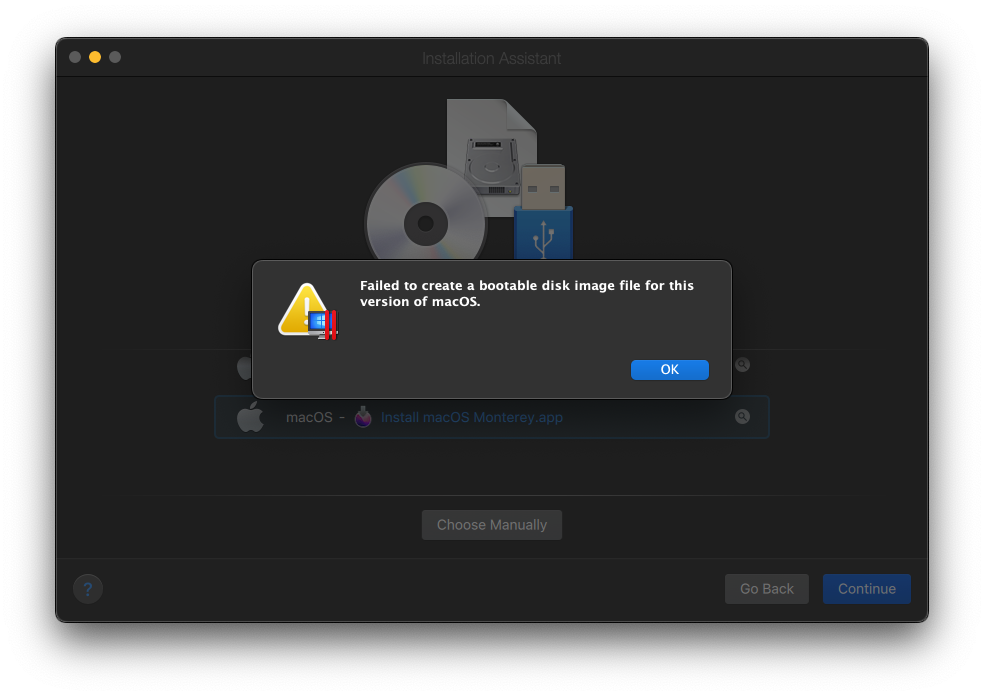

# Parallels-Fix
Fix Parallels issues

## Issue 1: Failed to create


## Solution (Issue 1)
```
git clone https://github.com/andreylzmw/parallels-fix
cd parallels-fix
make fix issue=1
```

## Download macOS installer
```
softwareupdate -d --fetch-full-installer --full-installer-version <version>
```

## Convert macOS installer to .iso image
```
/bin/bash '/Applications/Parallels Desktop.app/Contents/Resources//repack_osx_install_app.sh' repack '/Applications/Install macOS Monterey.app' '/Users/rxandrey/Parallels/macOS_Monterey.iso' -w
```
